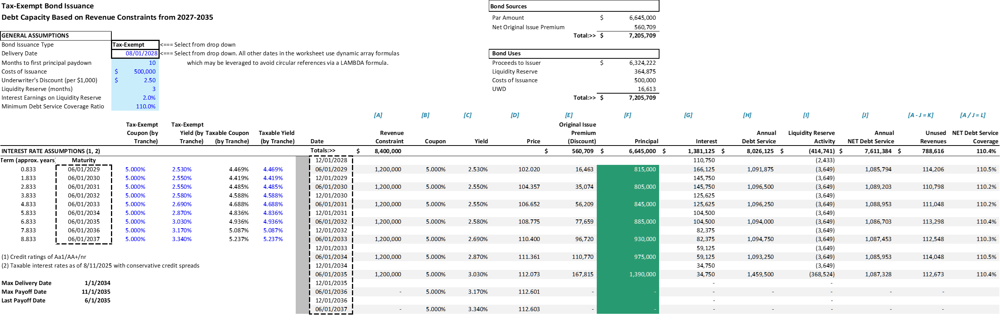

# Single-Issue Bonding Capacity — a worked model for `fx.DebtSizeIssueλ`

An Excel LAMBDA that sizes a new serial bond issue against a debt service coverage
test, and a workbook that shows it working.

**Par is an output, not an input.** You do not tell this function how much to issue.
You give it the revenue available in each year, the coverage ratio it has to hold, and
the coupon curve it will pay. It sizes each maturity to the covenant and reports the par
that results.

That inversion is the whole point, and it is why the obvious approach fails — see
[Why it needs a solver](#why-it-needs-a-solver).



---

## Opening it

Download [`Single-Issue-Bonding-Capacity.xlsx`](Single-Issue-Bonding-Capacity.xlsx) and
open it. **No add-in is required.** The function is stored in the workbook itself as a
defined name — open Name Manager (Ctrl+F3) and you will find `fx.DebtSizeIssueλ` there.

> **Name Manager will draw it wrong, and the function is fine.** Every argument of a 5G
> LAMBDA is optional, and Excel stores optional parameters with an internal `_xlop.`
> prefix that the *Refers to* box renders as a bare bracketed list. You will see
> `=[CFADS] [DSCR] [COUPON] … TRIM(TEXTSPLIT(` — no `LAMBDA(`, no commas. That is a
> display bug in that one text box, not a corrupted definition; only a LAMBDA can be
> invoked with `()`, and the workbook calculates. To read the source properly, use
> [`fx.DebtSizeIssue.txt`](fx.DebtSizeIssue.txt) or the Advanced Formula Environment.
>
> For the same reason, do not try to install this function by pasting into Name
> Manager. The *Refers to* box will not accept text that long, and the function is
> recursive — a name cannot reference itself before it exists. Use the gist and AFE,
> below.

You need a version of Excel with dynamic arrays and LAMBDA: **Microsoft 365** or
**Excel 2024**. It will not work in Excel 2019 or earlier, and the `λ` in the name means
the workbook must stay in a Unicode-aware Excel rather than a compatibility mode.

The model is one sheet:

| Rows | What |
|---|---|
| 3–35 | The issue: sources and uses, the rate scale, and the sized debt service schedule |
| 42–65 | The inputs, built as dynamic arrays that feed the function |
| 67–74 | The function's output, spilled from a single formula in `M68` |
| 80–101 | The function's own help text, spilled from `fx.DebtSizeIssueλ()` called with no arguments |

Row 80 onward is worth a look on its own: calling the function with no arguments returns
its documentation as a spilled array, so the help can never drift out of sync with the
code the way a separate manual does.

## Using it in your own workbook

The function's source lives in a gist and imports directly into
[Excel Labs' Advanced Formula Environment](https://www.microsoft.com/en-us/garage/profiles/excel-labs/):

**https://gist.github.com/wfphillips128/adb62caea3b10cac23f83b8c080c90c4**

[`fx.DebtSizeIssue.txt`](fx.DebtSizeIssue.txt) in this repo is a copy of that gist, kept
here so the repo is self-contained. The gist is the canonical version.

## Arguments

```excel
=fx.DebtSizeIssueλ(CFADS, DSCR, COUPON, DBTRSVPCT, DBTRSVRATE,
                   ParValueIncr, MONTHS, [MATURITY], [LastPayoffDate])
```

| Argument | Meaning |
|---|---|
| `CFADS` | Cash available for debt service, one value per period |
| `DSCR` | Coverage ratio the schedule must hold, per period |
| `COUPON` | Coupon on the tranche **maturing** in each period — a curve, not one rate applied to the balance. Flat is fine. |
| `DBTRSVPCT` | Debt service reserve as a % of **maximum annual** debt service. 25% is a three-months-of-MADS reserve. |
| `DBTRSVRATE` | Earnings rate credited on the reserve |
| `ParValueIncr` | Par rounding increment, e.g. 5000. Use 1 for none — never 0. |
| `MONTHS` | Months of interest in each period, e.g. `10, 12, 12, …` for a short first period |
| `MATURITY` | *Optional.* The maturity date of each period's tranche |
| `LastPayoffDate` | *Optional.* The last date a maturity may fall on |

It returns seven rows, one column per period:

```
Debt opening balance
Interest on principal balance
Principal repayments
Debt closing balance
Debt service
Debt reserve credit
Net debt service
```

Call it with no arguments at all and it spills its own help instead.

## How the sizing works

- **Semiannual coupons, annual principal**, and the coverage test is applied annually.
- **A short first period.** Year one usually carries fewer than twelve months of
  interest, because delivery rarely lands on an anniversary. That is what `MONTHS` is
  for: `10, 12, 12, …` rather than assuming a full year.
- **The reserve is sized off MADS**, not off par — `DBTRSVPCT` × maximum annual debt
  service. It earns `DBTRSVRATE`, which is credited against debt service each period,
  and the balance is **released in the final year**, where it funds principal.
- **Coupons are per tranche, not per year.** The interest owed in year *y* is the sum of
  the coupons on every tranche still outstanding — including the ones maturing after *y*.
  A flat coupon makes "balance × one rate" algebraically identical and hides this
  completely. A rising curve breaks it materially, and the sign of the error flips
  between early and late years.
- **The payoff date is a separate constraint from the number of periods.** A late
  delivery date can walk the far end of the maturity ladder past the date the issue must
  be retired by. `LastPayoffDate` marks those periods dead so nothing is sized into them
  — and, more importantly, so the reserve releases at the last *live* period. Released
  into a dead period it funds nothing, and every reserve credit in every period moves.

### Why it needs a solver

The tempting approach is to feed the previous iteration's payment forward and let it
settle. That is fixed-point iteration, and it converges nicely when the opening balance
is given.

It **diverges** once the issue size is the unknown, because the loop is unstable in that
direction: raising the balance raises interest, and higher interest cuts the principal
you can afford by *more* than the balance rose. Excel's own iterative-calculation setting
has the same problem, on top of turning every circular reference in the workbook into a
silent one.

So the function bisects instead — on **total annual coupon**, where the residual is
monotonic and the search is unconditionally stable. Two details matter:

1. Par rounding means the residual can never reach exactly zero, so the search ends
   straddling the answer. It terminates on the **feasible** side, where rebuilt interest
   is below sizing interest in every period. Stopping on the other side leaves coverage
   fractionally under the covenant — 1.09999× against a 1.10 test, invisible behind a
   one-decimal display.
2. Once the bisection settles, the schedule is **rebuilt** on the par actually issued.
   Without that, every interest figure is overstated by an amount small enough to pass
   for a rounding artefact.

## What is in the worked example

Illustrative figures throughout — a $1.2m annual revenue constraint, a 1.10× test, a 5%
tax-exempt coupon, 8/1/2028 delivery. **These are not a real transaction**; the model is
here to show the mechanics.

It sizes to par of **$6,645,000** across seven maturities, and ties out:

- par equals the sum of the sized maturities,
- the closing balance at the last live period is **0.00**,
- minimum coverage across all periods is **1.1017×** against the 1.10 test — and the
  minimum is the number to check, not par, since par can look right while a single
  period sits a couple of basis points under,
- the final reserve release is MADS × 25% × 1.02 = **$372,172.50** exactly, which is the
  quickest way to confirm the reserve logic survived an edit.

The 8/1/2028 delivery date is deliberate: it is late enough to push the last two rungs of
the ladder past the payoff date, so the workbook demonstrates the dead-period handling
rather than just describing it.

## Status

Finished and not under active development. It is published as a reference, not as a
maintained project — no issues or pull requests are expected.

## License

MIT — see [LICENSE](LICENSE).
